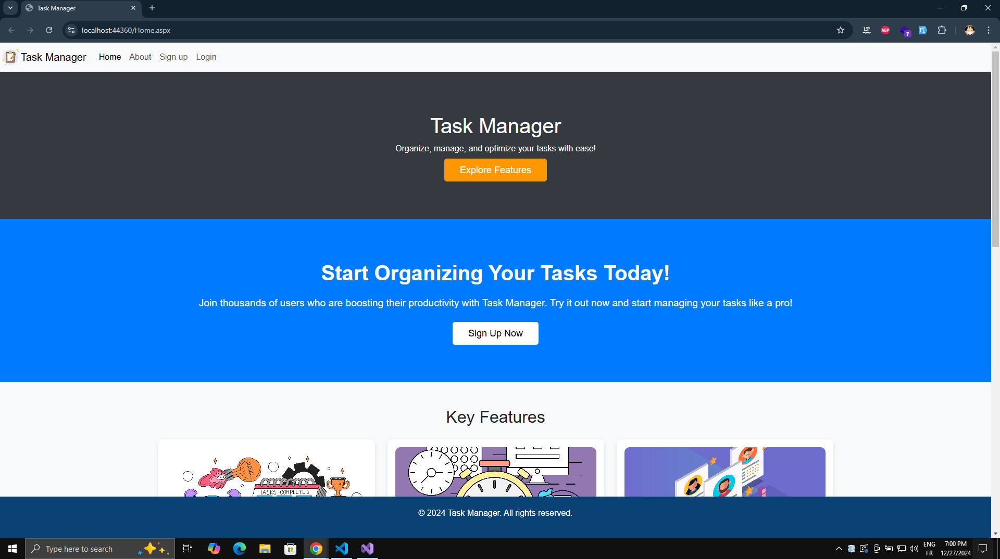
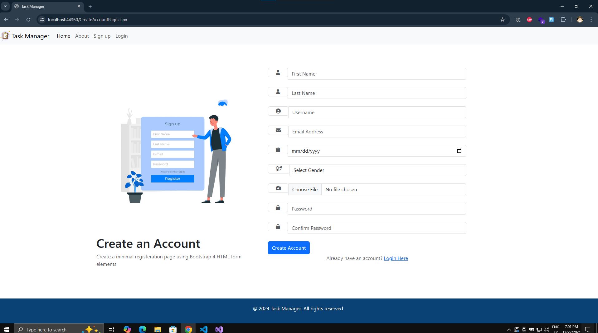
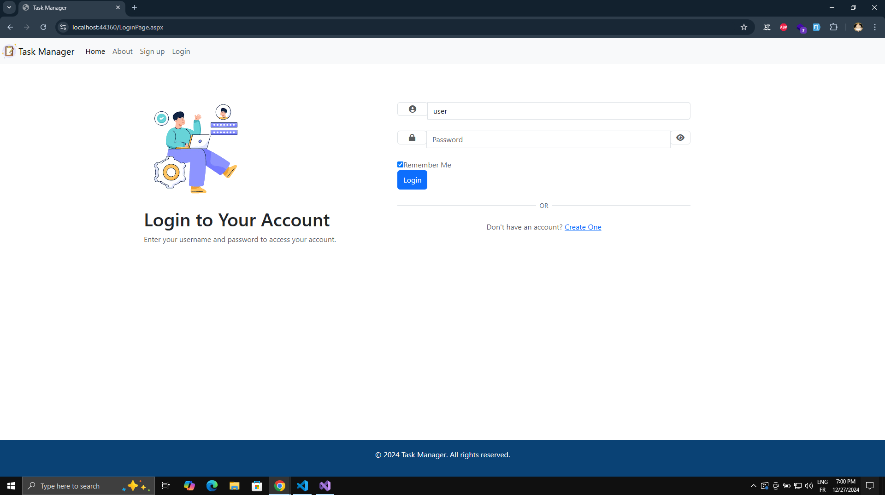
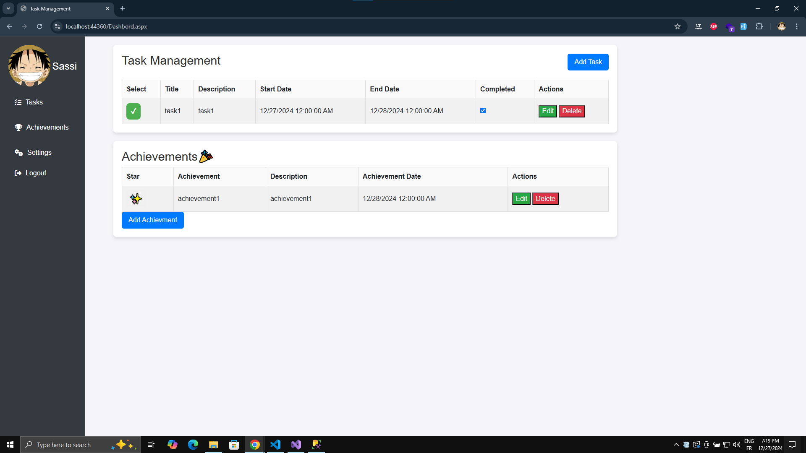

# TaskManagement

**TaskManagement** is an application designed to help you efficiently organize and manage your daily tasks. With a user-friendly interface and robust features, it allows users to create, update, and track tasks with ease.

---


## 📋 Overview

The **Task Management Application** is a user-friendly tool aimed at improving productivity by helping users manage tasks, set and track goals, and update personal profiles. This application offers an easy-to-use interface for managing tasks and accomplishments.

### Key Features:
- **User Management**: Account creation, login functionality, profile updates (including photo, username, and personal data validation).
- **Task Management**: Add, update, delete, and mark tasks as completed or in progress.
- **Achievements Tracking**: Record and manage personal milestones and accomplishments with CRUD operations.
- **Comprehensive Validations**: Ensures all data entered is accurate and valid.
- **Responsive UI**: Built with HTML, JavaScript, and Bootstrap for an attractive and adaptive user interface.

---

## 🛠️ Technologies Used

- **Backend**: .NET Framework (version 4.8) with C#
- **Frontend**: Windows Forms, HTML, JavaScript, Bootstrap
- **Database**: SQL Server
- **Asynchronous Communication**: AJAX and JSON

---

## 🚀 Installation and Setup

### Prerequisites
Make sure the following are installed on your system before proceeding:
1. **.NET Framework 4.8** or higher
2. **Visual Studio** (with support for Windows Forms development)
3. **SQL Server** and **SQL Server Management Studio (SSMS)**
4. An **Internet Browser** (e.g., Google Chrome)

### Steps

1. Clone the repository:
   
   ```bash
   git clone https://github.com/babader24/TheTasksManager.git
   
2. Restore `TaskManegmentBackup` to SQL Server.  
3. Go to the `DataAccess` layer and find the `cls_Settings` class.  
4. Update the connection string with your own SQL Server settings credentials (e.g., ID, password).  
5. In the `Create Account` page, specify your preferred directory for images and the `.txt` file used for storing user credentials.  
6. On the `Dashboard`, set the directory path for uploading profile images to suit your preferences.  
7. Build the solution to resolve dependencies.  
8. Run the application.  


=======

# 🛠️ Build and Run the Solution in Visual Studio

1. **Build and Run the Solution**: 
   Open the project in Visual Studio and run the solution.
2. **Explore Features**:  
   Use the provided admin account or create a new user to explore all features.

---

## 🖼️ Screenshots

### Home Page


### Sign Up Page


### Login Page


### Dashboard



---

## 🎯 High-Quality Practices

- **Three-Tier Architecture**:  
  Separates presentation, business logic, and data layers for maintainability.
- **CRUD Implementation**:  
  Enables robust data management for users, tasks, and achievements.
- **Responsive Design**:  
  Utilizes Bootstrap for cross-device compatibility.
- **Efficient Data Exchange**:  
  Incorporates AJAX and JSON for seamless asynchronous operations.

---

## 🌟 Features in Action

- **Task Management**:  
  Easily add and organize tasks.
- **Achievements**:  
  Celebrate milestones by adding achievements.
- **User Profiles**:  
  Customize personal details with photo upload support.
- **Data Validation**:  
  Guarantees seamless and error-free user interactions.


